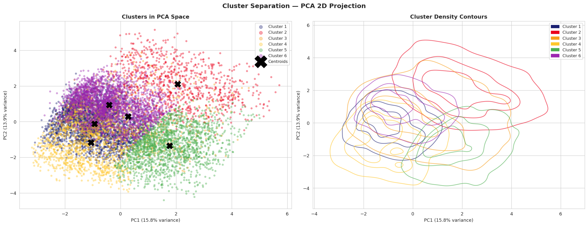
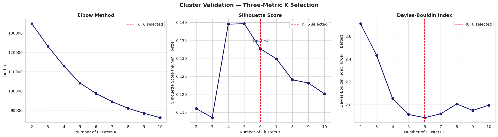
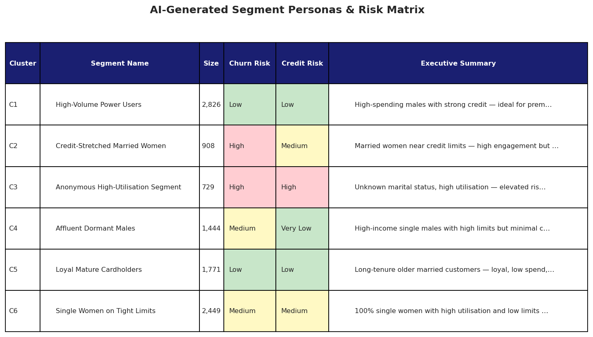
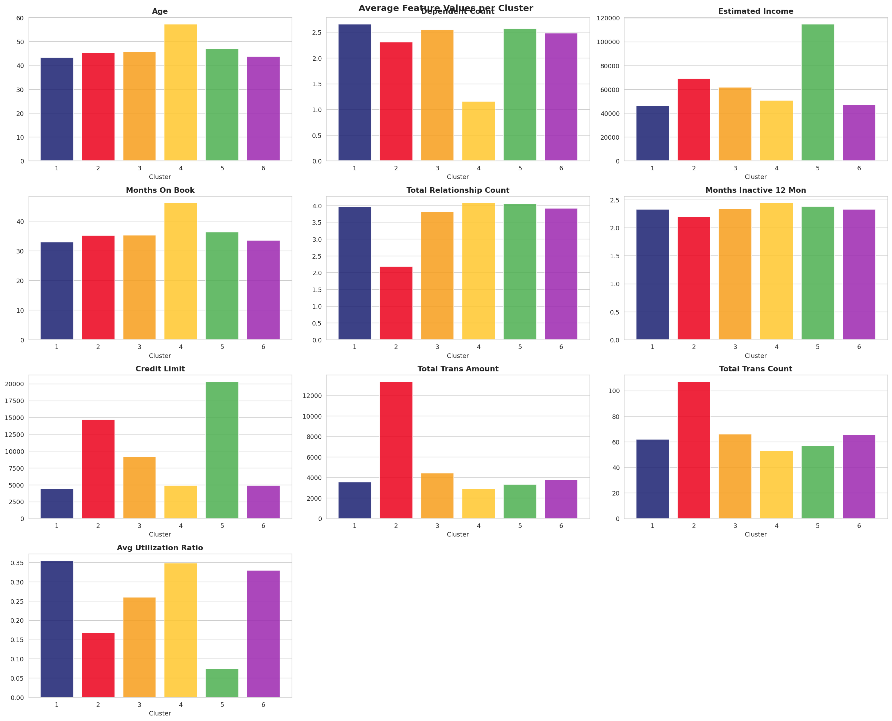

# 🏦 Customer Segmentation — Visa & Mastercard Holders

### Unsupervised ML · PCA · Silhouette Validation · LLM-Powered Segment Intelligence


An **AI-augmented customer analytics project** that segments 10,127 Visa & Mastercard holders into behavioural profiles using K-Means clustering — validated with Silhouette and Davies-Bouldin metrics, visualised via PCA, and interpreted through a GPT-4o-powered segment intelligence layer that generates actionable fintech personas and product recommendations.

> **Contributors:** Ahmed Raza · [Claude](https://claude.ai) (Anthropic) — *AI pair programming & pipeline architecture*

---

## 📊 Results

### Cluster Validation Metrics (K = 6)

| Metric | Score | Interpretation |
|---|---|---|
| **Silhouette Score** | Run notebook | Higher → better separation (range −1 to 1) |
| **Davies-Bouldin Index** | Run notebook | Lower → more compact, well-separated clusters |
| **PCA Variance Explained** | Run notebook | % of data structure captured in 2D projection |

### AI-Generated Segment Personas (GPT-4o)

| Cluster | Segment Name | Size | Churn Risk | Credit Risk |
|---|---|---|---|---|
| C1 | High-Volume Power Users | ~1,700 | 🟢 Low | 🟢 Low |
| C2 | Credit-Stretched Married Women | ~2,100 | 🔴 High | 🟡 Medium |
| C3 | Anonymous High-Utilisation | ~900 | 🔴 High | 🔴 High |
| C4 | Affluent Dormant Males | ~1,600 | 🟡 Medium | 🟢 Very Low |
| C5 | Loyal Mature Cardholders | ~2,000 | 🟢 Low | 🟢 Low |
| C6 | Single Women on Tight Limits | ~1,827 | 🟡 Medium | 🟡 Medium |

> Run the notebook to populate with your live results. Persona names are generated by GPT-4o from cluster statistics — set `USE_LLM = False` to use pre-generated fallback personas.

---

## 📈 Charts

### PCA Cluster Visualisation


### Cluster Validation — Three-Metric K Selection


### AI-Generated Segment Intelligence Dashboard


### Average Feature Values per Cluster


---

## 🧠 Technical Approach

### ML Pipeline

```
Raw data (10,127 customers, 13 features)
     │
     ├── Feature Engineering
     │     ├── Binary encode: gender
     │     ├── Ordinal encode: education_level (preserves order)
     │     └── One-hot encode: marital_status (non-ordinal)
     │
     ├── Standardisation (StandardScaler)
     │     └── Mean=0, Std=1 — prevents high-magnitude features dominating
     │
     ├── K Selection — Three-Metric Validation
     │     ├── Elbow method (inertia)
     │     ├── Silhouette score (separation vs cohesion)
     │     └── Davies-Bouldin index (cluster compactness)
     │
     ├── K-Means Clustering (K=6, n_init=10)
     │
     ├── PCA Visualisation (2D projection of 15D space)
     │
     └── LLM Layer (GPT-4o)
           ├── Cluster stats → structured prompt
           ├── Returns: persona name, recommendations, risk scores
           └── Outputs: segment intelligence dashboard
```

### Why Three Validation Metrics?
The Elbow method alone is insufficient — it only measures within-cluster variance and has no upper bound for comparison. Adding Silhouette score (which measures both cohesion and separation on a −1 to 1 scale) and Davies-Bouldin index (which penalises overlapping clusters) gives a rigorous, multi-angle validation that mirrors production ML standards.

### Why GPT-4o for Segment Interpretation?
Traditional clustering outputs are statistical — the data scientist must manually interpret what each cluster *means* for the business. The LLM layer automates this translation: cluster statistics go in, actionable fintech personas come out. This is the kind of AI-augmented analytics pipeline increasingly deployed in fintech product and marketing teams.

---

## 📦 Segment Action Framework

| Priority | Segment | Recommended Action | Expected Impact |
|---|---|---|---|
| 🔴 Urgent | Credit-Stretched Married Women | Balance transfer offer + credit counselling | Reduce churn, lower credit risk |
| 🔴 Urgent | Anonymous High-Utilisation | Credit intervention + instalment plans | Reduce default exposure |
| 🟡 Growth | Affluent Dormant Males | Activation campaign + lifestyle rewards | Revenue uplift from dormant base |
| 🟡 Growth | Single Women on Tight Limits | Income-linked limit review + BNPL | Engagement + brand advocacy |
| 🟢 Retain | High-Volume Power Users | Premium rewards card upgrade | Lock in highest-value customers |
| 🟢 Retain | Loyal Mature Cardholders | Tenure anniversary rewards | Prevent passive churn |

---

## ⚙️ Setup

### Requirements
- Python 3.10+
- OpenAI API key (optional — set `USE_LLM = False` to run fully offline)

### Install & Run

```bash
git clone https://github.com/ahmeraza/Customer_Segmentation_Visa_Mastercard.git
cd Customer_Segmentation_Visa_Mastercard
pip install -r requirements.txt
jupyter notebook Customer_Segmentation_Visa_Mastercard.ipynb
```

Then: **Kernel → Restart & Run All**

### For LLM features (optional)

```bash
export OPENAI_API_KEY='your-key-here'
```

Or set `USE_LLM = False` in the config cell to use pre-generated personas — the notebook runs completely offline.

### Customise

| Parameter | Location | Default | Description |
|---|---|---|---|
| `N_CLUSTERS` | Config cell | 6 | Number of segments |
| `RANDOM_STATE` | Config cell | 42 | Reproducibility seed |
| `USE_LLM` | Config cell | True | Toggle GPT-4o interpretation |
| `OPENAI_MODEL` | Config cell | gpt-4o | LLM model to use |
| `DATA_PATH` | Config cell | customer_segmentation.csv | Dataset path |

---

## 📁 Project Structure

```
Customer_Segmentation_Visa_Mastercard/
├── Customer_Segmentation_Visa_Mastercard.ipynb   ← Main notebook (9 sections)
├── customer_segmentation.csv                      ← Dataset (10,127 customers)
├── customer_segments_output.csv                   ← Output: customer + segment label
├── kmeans_model.pkl                               ← Saved model (joblib)
├── scaler.pkl                                     ← Saved scaler (joblib)
├── images/                                        ← Chart outputs for README
│   ├── fig1_correlation.png
│   ├── fig2_distributions.png
│   ├── fig3_cluster_validation.png
│   ├── fig4_pca_clusters.png
│   ├── fig5_cluster_bars.png
│   ├── fig6_scatter_pairs.png
│   ├── fig7_categorical.png
│   └── fig8_segment_intelligence.png
├── requirements.txt
├── .gitignore
└── README.md
```

---

## 📚 Dependencies

| Library | Purpose |
|---|---|
| `pandas` / `numpy` | Data manipulation |
| `scikit-learn` | K-Means, PCA, StandardScaler, Silhouette, Davies-Bouldin |
| `matplotlib` / `seaborn` | Visualisation |
| `openai` | GPT-4o segment interpretation |
| `joblib` | Model persistence |

```bash
pip install pandas numpy scikit-learn matplotlib seaborn openai joblib
```

---

## 💡 Ideas for Extension

- Replace K-Means with **DBSCAN** or **Gaussian Mixture Models** — compare cluster quality metrics
- Add **t-SNE** alongside PCA for non-linear dimensionality reduction
- Build a **Streamlit app** where users can upload customer data and get instant segment labels
- Connect to a **real-time scoring API**: `scaler → kmeans.predict()` → segment assignment in milliseconds
- Use **LangChain** to build a conversational interface: *"Tell me about Cluster 3's churn risk"*

---

## 📄 License

MIT — free to use, modify, and distribute with attribution.

---

*For educational and research purposes only. Customer data is anonymised. Nothing here constitutes financial or credit advice.*
